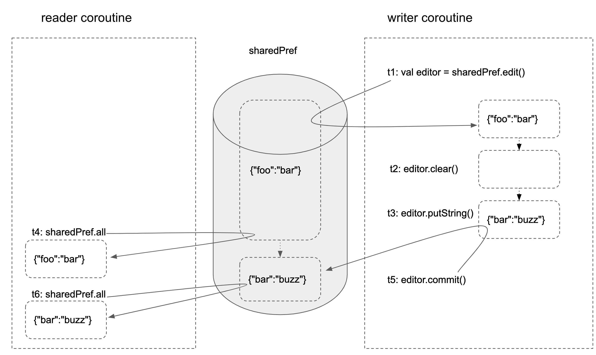

# How SharedPreferences.Editor works

https://developer.android.com/training/data-storage/shared-preferences

- Changes during editing is isolated (see diagram below). 
- Commit is atomic operation.

